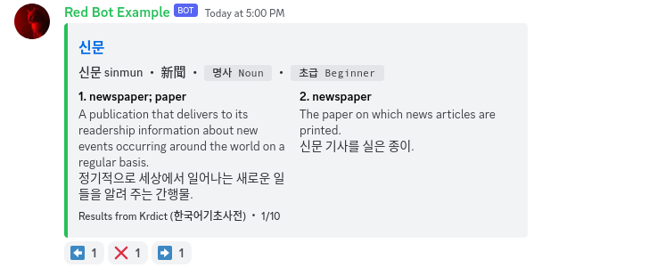

# 🍵 차 Cha for Korean

<p class="text-3xl pt-0 mt-0">A delightfully refreshing Discord bot for searching and translating Korean.</p>

<component-coghero cog="kodict" desc="Korean dictionary bot. Searches National Institute of Korean Language's Korean-English Learners' Dictionary (한국어기초사전) using their Open API."></component-coghero>




## About

**CHA-KO is the Korean Discord bot that delivers language and dictionary information to students, travelers, and kpop/kdrama enthusiasts alike.**

Korean, with its unique alphabet, is a fascinating language that draws learners from around the world. However, the journey to fluency can be challenging. Learners often struggle with understanding the language's structure, pronunciation, Hanja, and the cultural nuances inherent to Korean.

**CHA-KO** is a unified turnkey solution for searching dictionary sources, displaying Hangul Romanization, word definitions/origins, and links to relevant external sources.

**CHA-KO** uses data from public sources including the National Institute of Korean Language's [Korean-English Basic Learners' Dictionary](https://krdict.korean.go.kr/mainAction).


## Getting Started

[Public bot (free), hosted by Thyme Dev >](https://thymedev.github.io/docs/cha/ko)

You can also [self-host this bot](/start) or [join the Discord](https://coffeebank.github.io/discord) for updates and news!

(Docs coming soon)

https://krdict.korean.go.kr/openApi/openApiInfo

`[p]set api krdict api_key,YOURAPIKEYHERE`


## Features

- Search dictionary entries in Korean (Hangul, Hanja)
- Search dictionary entries in English
- Pronunciation in Hangul and Romanization
- Word origins in Hanja
- Parts of speech


## Commands

- `[p]kodict` : Searches Korean dictionary
- `[p]kosearch` : Searches Korean translation services
<br /><br />

## Install

### Step 1: Download

Clone or download this project.

### Step 2: Add your Discord Bot info

Make an `.env` file, and:
- Add your bot's token to `dpy_token`
- Add your bot's User ID to `dpy_user_id`

The bot prefix is @ping or Slash command.

### Step 3: Run the Bot

Setup a [venv](https://docs.python.org/3/library/venv.html) using Python >=3.9 and install requirements

```
python3.9 -m venv ~/dpyenv
source ~/dpyenv/bin/activate
pip install -r requirements.txt
```

In the future, you can run your bot anytime using
```
source ~/dpyenv/bin/activate
python3 -m main
```


## Support

[Join the Discord >](https://coffeebank.github.io/discord)
